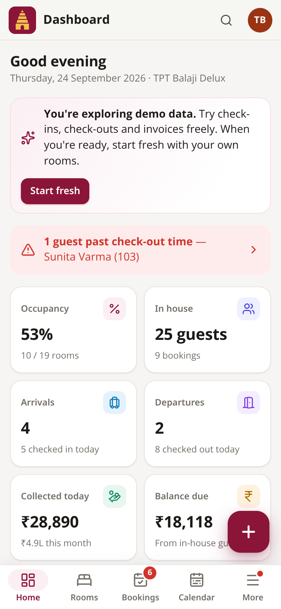
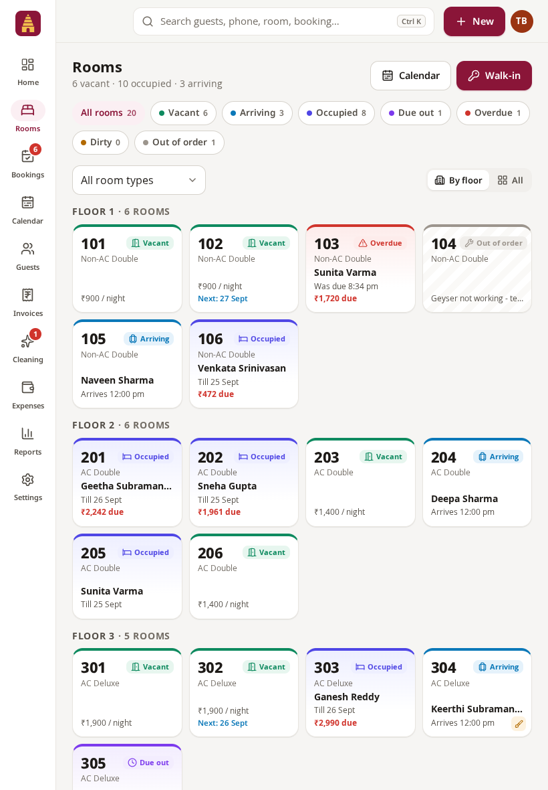
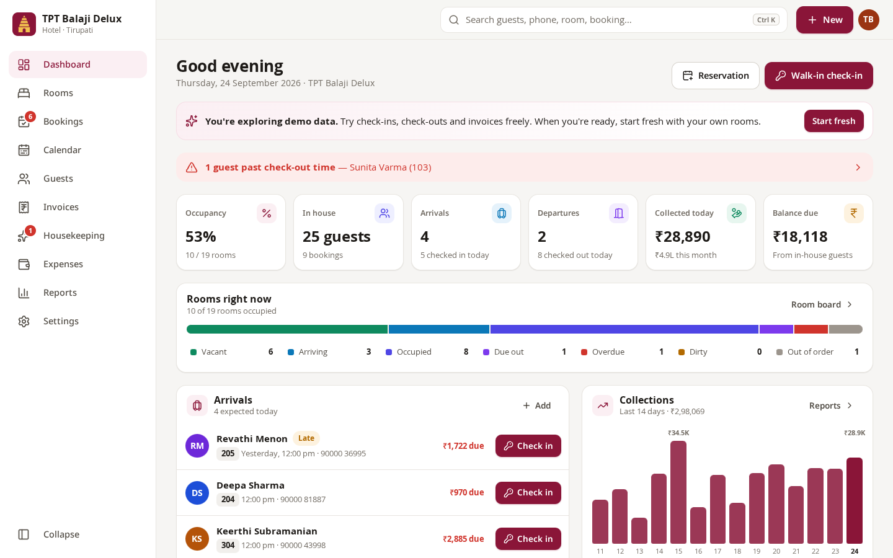
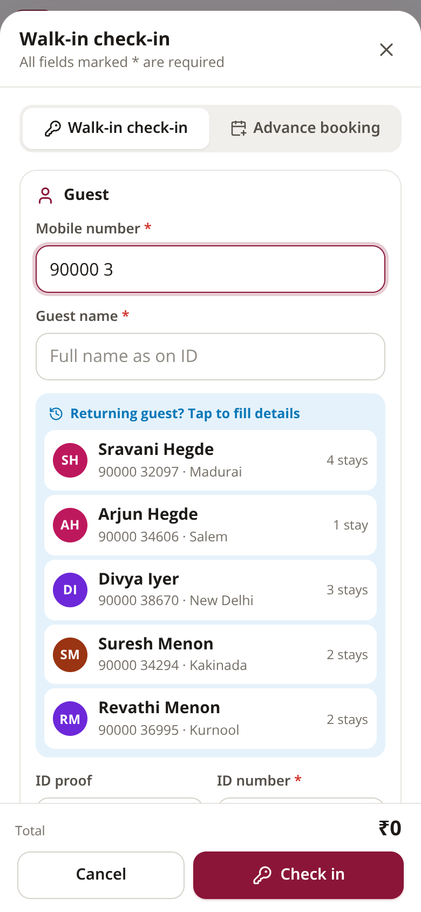
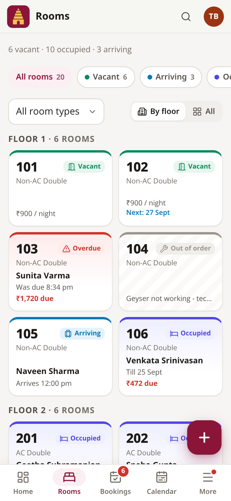
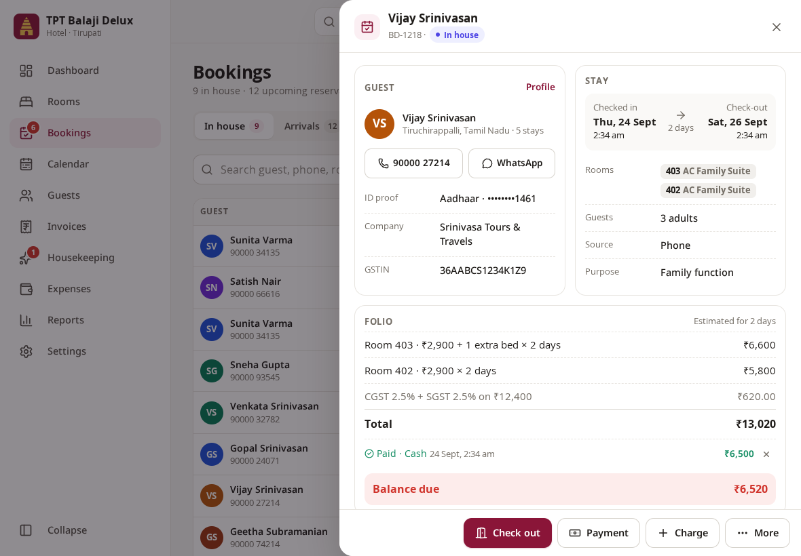
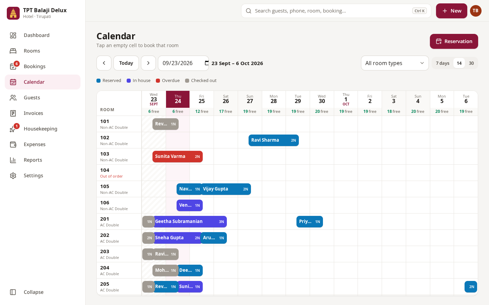
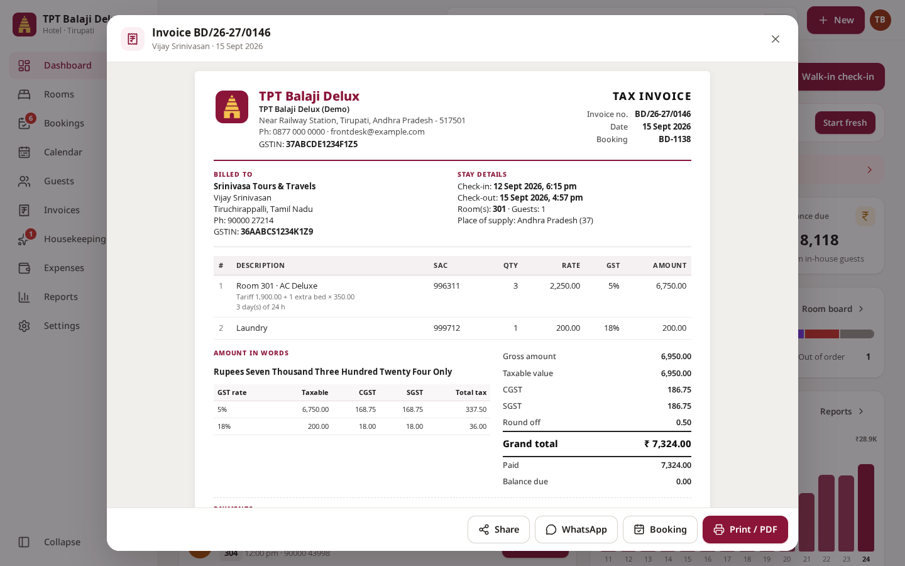

# TPT Balaji Delux — Hotel Manager

A complete hotel administration app for **TPT Balaji Delux, Tirupati** that works on
**mobile phones, iPads/tablets, laptops and desktops** — in any modern browser, installable
as an app, and usable **offline**.

Front desk, owner and housekeeping staff can all use it: walk-in check-in in under a minute,
advance reservations, a live room board, a reservation calendar, GST invoices, payments,
housekeeping, expenses and reports.

| Phone | iPad (portrait) | Desktop |
|---|---|---|
|  |  |  |

<details>
<summary>More screenshots</summary>

| | |
|---|---|
|   |  |
|  |  |

</details>

---

## Features

- **Dashboard** — occupancy, in-house guests, today's arrivals and departures with one-tap
  *Check in* / *Check out*, overdue guests, money collected, pending balances, 14-day collections chart.
- **Room board** — every room's live status (vacant, arriving, occupied, due out, overdue, dirty,
  out of order), grouped by floor, with filters. Tap a room for guest details, housekeeping and quick booking.
- **Bookings** — walk-in check-in or advance reservation, returning-guest lookup by phone,
  several rooms per booking, extra beds, discounts, advance payments, ID proof, booking source & purpose.
- **Folio & check-out** — extra charges (food, laundry, taxi…), payments and refunds in any mode
  (Cash, UPI, Card…), automatic stay calculation, balance, check-out with invoice. Call / WhatsApp the guest.
- **24-hour check-out** (common in Tirupati) or fixed check-out time, with grace period — configurable.
- **GST invoices** — correct CGST + SGST per slab, SAC codes, amount in words, place of supply,
  sequential invoice numbers per financial year (`BD/26-27/0001`), print / save as PDF, share on WhatsApp.
  Invoices are frozen at check-out, so later tariff changes never alter old bills.
- **Reservation calendar** (tape chart) — rooms × days, 7/14/30-day views, free rooms per day,
  tap an empty cell to book that room for that date.
- **Guests** — searchable directory with stay history and total billed; CSV export.
- **Housekeeping** — rooms turn *dirty* automatically at check-out; mark clean/inspected, assign staff, out-of-order.
- **Expenses** — electricity, salaries, laundry, repairs…; category breakdown; CSV export.
- **Reports** — occupancy, ADR, RevPAR, room revenue, collections by payment mode, GST summary by slab,
  expenses, net cash, bookings by source, day-by-day table; CSV exports and print.
- **Settings** — hotel profile & logo, GSTIN, room types/tariffs/room numbers (bulk add `101-110`),
  tax slabs, charge categories, lists (sources, payment modes, ID types), invoice numbering & terms,
  users & roles (server mode), backup/restore, theme, install help.
- **Extras** — global search (`Ctrl K`), keyboard shortcuts, dark mode, optional device PIN lock,
  Android back button closes dialogs, English (India) formatting (₹1,23,456), works offline.

## Works on every screen

| Device | Layout |
|---|---|
| Phones (< 700 px) | Top bar, bottom tabs (Home · Rooms · Bookings · Calendar · More), floating **+** button, full-screen forms, card lists |
| iPad portrait / small tablets (700–1099 px) | Icon navigation rail, centred dialogs, two-column cards |
| iPad landscape, laptops, desktops (≥ 1100 px) | Full sidebar (collapsible), tables, side drawers for details, multi-column dashboard |

Touch targets are at least 44 px, inputs use 16 px text (no iOS zoom), safe areas for notched
phones are respected, and landscape phones get a compact layout.

---

## Two ways to run it

### 1. On its own (one device) — no setup

The app is plain HTML/CSS/JavaScript with **no build step**. Any of these work:

- **GitHub Pages (recommended):** in this repository go to *Settings → Pages*, choose
  *Deploy from a branch*, branch `main`, folder `/ (root)`, and save. After a minute the app is live at
  `https://prakash1993ui.github.io/TPT-Balaji-delux/` — open it on any phone, iPad or PC and install it.
- **Open the file:** download the repository and double-click `index.html`.
- **Single file:** `npm run build:single` creates `standalone/tpt-balaji-delux.html` — one file you can
  copy to any computer (or pen drive) and double-click.

In this mode data is saved **in that browser on that device** (IndexedDB). Each device has its own
separate data, so use this for a single front-desk computer or to try the app. Download a backup regularly
(*Settings → Backup & data*); the app reminds you every 7 days.

### 2. Hotel server — all devices share live data

Run the included server on one computer at the hotel (or a small cloud server). Every phone, iPad
and PC then signs in and sees the **same data, updated live** (changes appear on other devices within a second).
Devices keep working if the Wi-Fi drops and sync automatically when it's back.

Requires [Node.js](https://nodejs.org) 18 or newer — no other installs.

```bash
node server/server.js
# or choose the port and first admin password:
PORT=8080 ADMIN_PASSWORD='choose-a-strong-one' node server/server.js
```

On first start an `admin` account is created (the password is printed and saved in
`data/initial-admin-password.txt` if you didn't set `ADMIN_PASSWORD`). The server prints the address to
open on other devices, e.g. `http://192.168.1.20:8080` (same Wi-Fi).

Then sign in as admin, add staff accounts in *Settings → Users & login*, and change the admin password.

| Role | Can do |
|---|---|
| **Admin** | Everything, including settings, users, numbering, backup/restore |
| **Manager** | Front desk + reports, revenue, tariffs & rooms, deleting records |
| **Staff** | Front desk (bookings, check-in/out, payments, guests, expenses) and housekeeping; no reports or settings |

Server data lives in `data/` (never committed to Git): `db.json`, `auth.json` and daily compressed
backups in `data/backups/` (last 60 days, plus one before every restore).

Forgot the admin password? `node server/server.js --reset-password admin NewPassword123`

**Can't sign in?**

- Usernames are not case-sensitive; passwords are. Spaces pasted before/after a password are ignored.
- After 10 wrong attempts from the same device the username is blocked for 15 minutes (restarting the server clears it).
- The server prints every sign-in (and failed attempt) with the device type. Start it with `LOG_REQUESTS=1` to also
  log every request — useful if a proxy is in the way.
- Behind proxies that strip or block the `Authorization` header (some hosting previews, CDNs and company
  gateways), the app automatically sends its sign-in token another way (an `X-TBD-Token` header, or as a last resort
  in the request URL) — no configuration needed.

> **HTTPS for phones:** installing the app and offline caching need HTTPS (or `localhost`).
> On a hotel LAN over plain `http://`, everything works but the app isn't installable. For HTTPS put the server
> behind a reverse proxy such as [Caddy](https://caddyserver.com) (automatic certificates), a Cloudflare Tunnel or Tailscale.

## Install as an app

- **iPhone / iPad (Safari):** Share → *Add to Home Screen*
- **Android (Chrome):** ⋮ menu → *Install app* / *Add to Home screen*
- **Windows / Mac (Chrome or Edge):** install icon at the right end of the address bar

The installed app opens full-screen, has home-screen shortcuts (Walk-in check-in, New reservation, Room board)
and loads instantly, even without internet.

---

## Daily use in 60 seconds

1. **Walk-in guest:** tap **+** (or *Walk-in check-in*), type the mobile number — returning guests fill in
   automatically — add ID proof, choose days and a free room, enter the amount received, **Check in**.
2. **Advance booking:** same form, *Advance booking* tab, choose the date. It appears under *Arrivals*
   on that day with a **Check in** button.
3. **Extra charges / payments:** open the booking → *Charge* or *Payment*.
4. **Check-out:** *Check out* → the app suggests the days to charge by your policy → collect the balance →
   **Complete check-out** → invoice opens for *Print / PDF* or *WhatsApp*. The room becomes *dirty*.
5. **Housekeeping:** mark rooms clean from the dashboard or the *Housekeeping* page.

## GST (India) — how bills are calculated

- Hotel accommodation from 22 Sep 2025: **5 %** (without input tax credit) when the value of a room
  is **≤ ₹7,500 per night**, **18 %** above that. The slab is decided per room per night on the actual
  amount charged (tariff + extra bed − discount). SAC **996311**.
- Tax is split equally into **CGST + SGST** (intra-state). Totals are rounded to the rupee with a round-off line.
- Extra charges carry their own rate (defaults: food 5 %, laundry 18 %, taxi 5 %; "same as room" for
  late check-out / extra bed). All editable in *Settings → Stay policy & GST*.
- Tariffs can be entered **with or without GST** (inclusive pricing back-calculates the tax).
- Not registered for GST? Switch it off — bills print as *Bill / Receipt* without tax lines.

The defaults are a convenience, not tax advice — confirm rates with your accountant and update the
slabs in Settings if the law changes.

**First things to update:** *Settings → Hotel profile* (legal name, address, GSTIN, phone, logo) and
*Settings → Rooms & rates* (your real rooms and tariffs), then *Backup & data → Start fresh* to clear the demo data.

---

## Project structure

```
index.html              App page (loads the scripts below, no build step)
manifest.webmanifest    PWA manifest (install as app)
sw.js                   Service worker (offline, auto-update) — bump VERSION when files change
css/app.css             All styles (mobile-first, dark mode, print)
js/core/                Data & logic (no UI)
  utils.js              Dates, ₹ formatting, amount in words, CSV, search
  persist.js            On-device storage (IndexedDB, localStorage fallback, multi-tab safe)
  store.js              In-memory store, settings defaults, roles, numbering, backup
  logic.js              Room status, availability, stay length, GST billing, bookings, reports
  sync.js               Server mode: login, offline queue, live sync
  demo.js               Demo data generator & "start fresh"
js/ui/kit.js            UI components (buttons, fields, modals/sheets, toasts, charts)
js/ui/icons.js          Icon set (Lucide)
js/views/*.js           Screens: dashboard, rooms & housekeeping, bookings, booking form, invoice,
                        calendar, guests, expenses, reports, settings, welcome/login/PIN lock
js/app.js               App shell: navigation, routing, search, theme, install, boot
server/server.js        Optional hotel server (Node.js, zero dependencies)
tools/build-single.js   Builds the one-file version
tests/                  Automated tests (core logic + server)
vendor/                 Preact, Preact Hooks, htm (see vendor/LICENSES.md)
```

Built with [Preact](https://preactjs.com) + [htm](https://github.com/developit/htm) (about 16 KB, vendored,
no bundler) and [Lucide](https://lucide.dev) icons.

## Development

```bash
npm test                 # unit tests (GST, stay length, billing, demo data) + server integration tests
npm start                # run the hotel server on http://localhost:8080
npm run build:single     # standalone/tpt-balaji-delux.html
```

Any static file server also works for local mode, e.g. `python3 -m http.server 8000`.
After changing app files, bump `VERSION` in `sw.js` so installed devices receive the update
(they switch to the new version by themselves at a safe moment — never while a form is open). The hotel server
does this automatically by fingerprinting `sw.js`.

## Third-party licenses

Preact & Preact Hooks (MIT), htm (Apache-2.0) and Lucide icons (ISC) — see [`vendor/LICENSES.md`](vendor/LICENSES.md).
